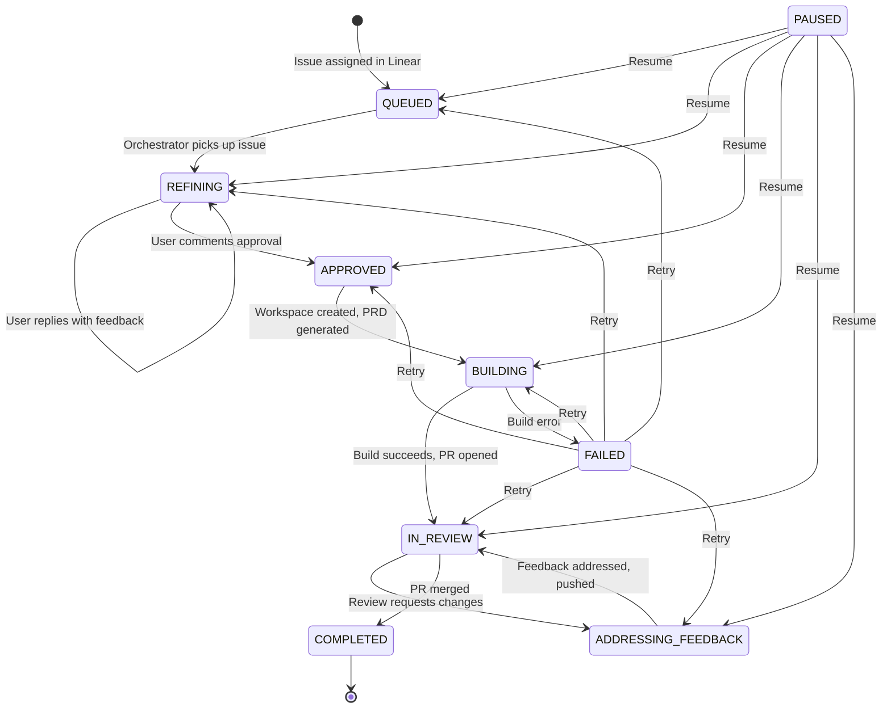

# Lifecycle

AutoRalph manages each issue through a deterministic state machine. Every
issue progresses through a series of states, with transitions triggered by
external events (user actions, PR reviews, merges) or internal completions
(build success, feedback addressed).

## State Diagram

## States

| State | Description |
|-------|-------------|
| `QUEUED` | Issue discovered and ingested from Linear, waiting to be processed |
| `REFINING` | AI is reading the issue, asking clarifying questions via Linear comments |
| `APPROVED` | User approved the refined plan, ready for building |
| `BUILDING` | Workspace created, PRD generated, Ralph execution loop running |
| `IN_REVIEW` | Branch pushed, PR opened on GitHub, awaiting review |
| `ADDRESSING_FEEDBACK` | Reviewer requested changes, AI is addressing review comments |
| `COMPLETED` | PR merged, workspace cleaned up, Linear issue moved to Done |
| `FAILED` | An error occurred; can be retried via the API or dashboard |
| `PAUSED` | Issue paused by user or due to merge conflict; can be resumed |

## Transitions

| From | To | Trigger |
|------|----|---------|
| `QUEUED` | `REFINING` | Orchestrator picks up new issue |
| `REFINING` | `REFINING` | User replies with feedback (iteration) |
| `REFINING` | `APPROVED` | User comments `@autoralph approved` |
| `APPROVED` | `BUILDING` | Workspace created, PRD generated |
| `BUILDING` | `IN_REVIEW` | Build succeeds, PR opened |
| `BUILDING` | `FAILED` | Build fails (error stored in DB) |
| `IN_REVIEW` | `ADDRESSING_FEEDBACK` | GitHub review with changes requested |
| `IN_REVIEW` | `COMPLETED` | PR merged |
| `ADDRESSING_FEEDBACK` | `IN_REVIEW` | Feedback addressed, changes pushed |
| any active | `PAUSED` | User pauses via API or merge conflict |
| `PAUSED` | (previous state) | User resumes via API |
| `FAILED` | (previous state) | User retries via API |

## The Lifecycle in Detail

1. **Ingest**: The Linear poller discovers new issues assigned to a configured
   user and creates them in the local database as `QUEUED`.

2. **Refine**: AI reads the issue title and description, asks clarifying
   questions, and posts them as a Linear comment. The issue moves to
   `REFINING`.

3. **Iterate**: When the user replies on Linear, AI incorporates the feedback
   and posts an updated plan. This loop continues until the user is satisfied.

4. **Approve**: The user comments `@autoralph approved` on the Linear issue.
   AutoRalph extracts the approved plan and moves the issue to `APPROVED`.

5. **Build**: AutoRalph creates a git workspace (worktree + branch), generates
   a PRD from the approved plan, and invokes Ralph's execution loop. The issue
   moves to `BUILDING`.

6. **Open PR**: When the build succeeds, AutoRalph pushes the branch and opens
   a GitHub pull request with an AI-generated description. The issue moves to
   `IN_REVIEW`.

7. **Address Feedback**: If reviewers request changes, AutoRalph detects the
   `CHANGES_REQUESTED` review, feeds the comments to AI, commits fixes, pushes,
   and replies to each review comment. The issue moves to
   `ADDRESSING_FEEDBACK` and back to `IN_REVIEW`.

8. **Complete**: When the PR is merged, AutoRalph cleans up the workspace,
   updates the Linear issue state to "Done", and marks the issue as
   `COMPLETED`.

## Error Handling

- **Build failures** transition to `FAILED` with the error stored in the
  database. Users can retry via the dashboard or API.
- **Merge conflicts** during rebase automatically pause the issue. Users
  resolve the conflict and resume.
- **API failures** (Linear, GitHub) are retried with exponential backoff
  (3 attempts: 1s, 5s, 15s). HTTP 5xx errors retry; 4xx errors fail
  immediately.
