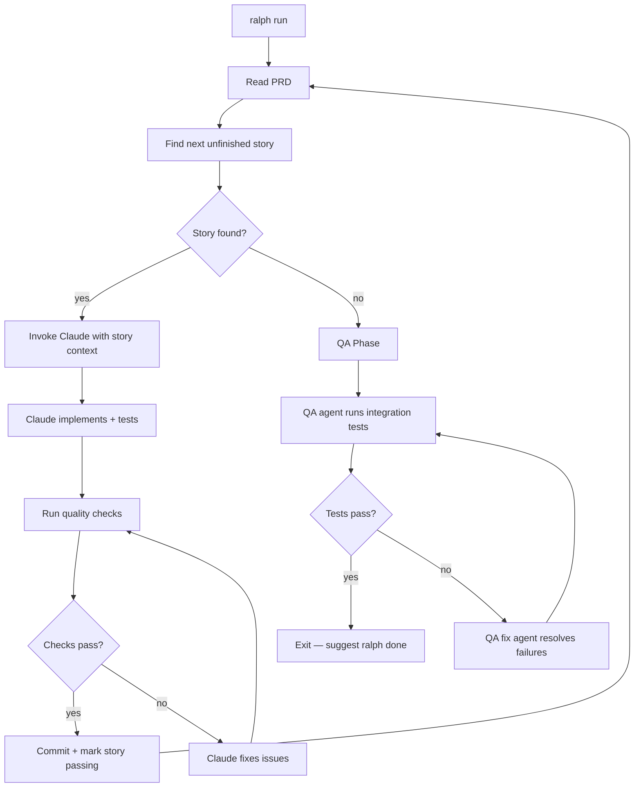
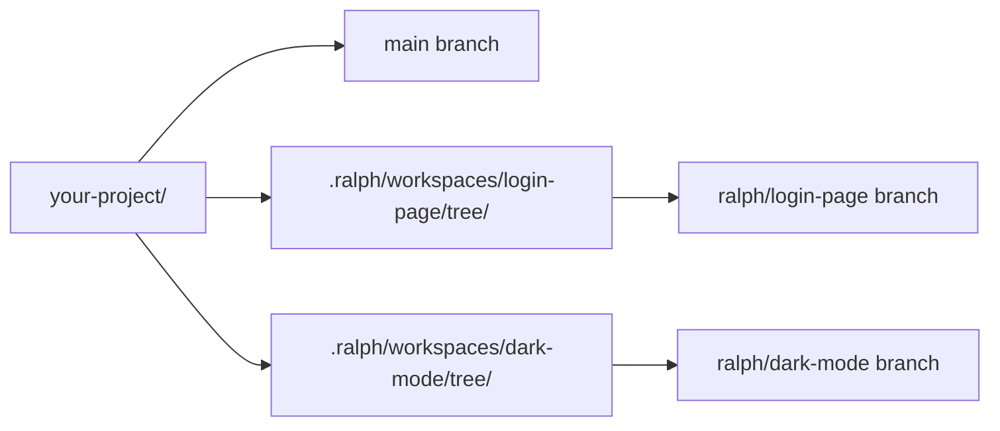

# Architecture

## Execution Loop

The execution loop is the core of `ralph run`. It picks up user stories one by one, implements them, and then runs a QA phase to verify integration tests.



Each iteration, the agent receives:
- The full PRD with story context and acceptance criteria
- The project's progress log (patterns discovered in earlier iterations)
- Recent git history for consistency
- Quality check commands to run

The agent writes code, runs tests via the configured `quality_checks`, commits on success, and appends a progress entry. The progress log carries context between iterations so later stories can build on patterns established by earlier ones.

### Event-Driven Output

The loop emits events (`ToolUse`, `StoryStarted`, `IterationStart`, etc.) consumed by either the TUI or a plain-text handler. This decouples the execution logic from the output rendering.

## Workspace Isolation

Each feature runs in a separate **git worktree**, keeping the main branch clean and enabling parallel agents.



A workspace consists of:

| Component | Location | Purpose |
|-----------|----------|---------|
| Git worktree | `.ralph/workspaces/<name>/tree/` | Isolated checkout on a dedicated branch |
| PRD | `.ralph/workspaces/<name>/prd.json` | Requirements driving the loop |
| Metadata | `.ralph/workspaces/<name>/workspace.json` | Name, branch, timestamps |
| Config copy | `tree/.ralph/` | Agent has full project context |
| Claude config | `tree/.claude/` | Agent rules and skills |

### Why Worktrees?

Git worktrees let multiple branches be checked out simultaneously in different directories. This means:

- No stashing or switching branches — each feature has its own directory
- Multiple `ralph run` instances can execute in parallel
- The main branch stays clean while features are in progress
- `ralph done` squash-merges everything into a single commit

### Base Mode

You can also run commands without a workspace (in **base** mode). This uses the main repo directory and stores the PRD at `.ralph/state/prd.json`. Workspaces are recommended for any non-trivial work, but base mode is useful for quick experiments or when you just want `ralph chat`.

## Project Structure

```
cmd/ralph/main.go              Entry point + CLI dispatch
internal/
  config/                      YAML config types + loading + discovery
  shell/                       Subprocess runner (exec.Command wrapper)
  prd/                         PRD JSON types + read/write/query helpers
  gitops/                      Git operations (worktrees, branches, rebase)
  workspace/                   Workspace lifecycle (create, remove, registry)
  claude/                      Claude CLI invocation + streaming output parsing
  prompts/                     Embedded prompt templates (go:embed)
  loop/                        The execution loop (stories -> QA -> done)
  events/                      Event system (EventHandler interface)
  tui/                         BubbleTea-based terminal UI
  commands/                    One file per CLI command
```

## Design Decisions

- **Minimal dependencies**: `yaml.v3` for config, `lipgloss`/`bubbletea`/`huh` for terminal UI, `doublestar` for glob patterns. Everything else is stdlib.
- **Shell out to CLIs**: `git` and `claude` are invoked as subprocesses. No API client libraries.
- **Prompts compiled into binary**: Markdown templates are embedded via `go:embed`. No external files needed at runtime (unless [ejected](configuration.md#prompt-customization)).
- **Workspace isolation**: Each feature runs in a separate git worktree, keeping the main branch clean and enabling parallel agents.
- **Event-driven output**: The loop emits events consumed by either the TUI or a plain-text handler.
