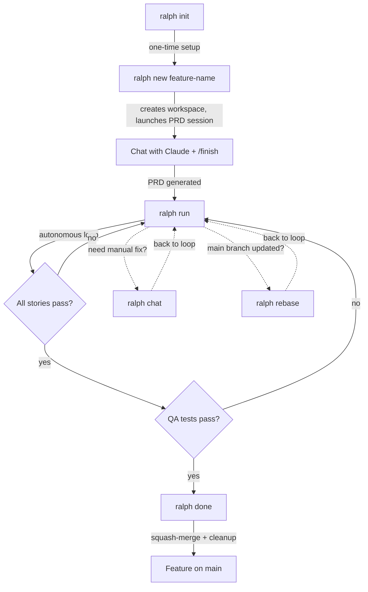

# Workflow

Ralph follows a linear workflow from project setup to feature completion. The four main commands — `ralph init`, `ralph new`, `ralph run`, and `ralph done` — map to the phases of the development cycle.

## Overview



## Phase 1: Initialize (`ralph init`)

One-time project setup. Creates the `.ralph/` directory with configuration, progress log, and prompt templates. Safe to run multiple times (idempotent).

During init, you choose whether to track Ralph files in git (recommended for teams) or keep them local. Optionally, Claude analyzes your project to auto-detect quality check commands (test runners, linters, type checkers).

## Phase 2: Plan (`ralph new`)

Creates a new workspace — an isolated git worktree on a dedicated branch — and launches an interactive PRD creation session with Claude.

**During the session:**

1. You describe the feature you want to build
2. Claude asks clarifying questions about scope, requirements, and edge cases
3. You discuss and refine until the plan is solid
4. Type **`/finish`** — Claude writes a structured PRD JSON file with:
   - User stories (ordered by dependency, right-sized for one iteration each)
   - Integration tests (end-to-end verification specs)

If the branch already exists from a previous attempt, Ralph asks whether to start fresh or resume.

## Phase 3: Build (`ralph run`)

The core of Ralph. Runs the autonomous execution loop that implements your feature story by story.

### The story loop

For each iteration, Ralph:

1. Reads the PRD and finds the next unfinished story
2. Invokes Claude with the story context, acceptance criteria, and project patterns
3. Claude implements the story, writes tests, and runs quality checks
4. On success, Claude commits and marks the story as passing in the PRD
5. Appends a progress entry to the shared progress log

### The QA phase

When all stories pass, Ralph enters QA:

1. A QA agent reads the integration test specs from the PRD
2. It builds and runs automated tests for each spec
3. If tests fail, a QA fix agent resolves the issues
4. The cycle continues until all integration tests pass

### Interrupting the loop

You can interact with the loop at any time:

- **`ralph chat`** — open a free-form Claude session to debug or make manual adjustments
- **`ralph rebase`** — rebase onto the latest base branch (Claude resolves conflicts using PRD context)
- **`ralph stop`** — gracefully stop the current run
- **`ralph attach`** — re-attach to a running loop from another terminal

## Phase 4: Complete (`ralph done`)

Finalizes the feature:

1. Verifies the base branch is an ancestor (prompts to rebase if not)
2. Generates a commit message from the PRD
3. Lets you edit the message before committing
4. Squash-merges into the base branch
5. Archives the PRD and removes the workspace
6. Returns you to the base repo directory

## Working on Multiple Features

Ralph supports multiple workspaces simultaneously. Each workspace is fully isolated with its own branch, PRD, and working directory:

```bash
ralph new login-page         # Start feature A (PRD created interactively)
# ... /finish, then:
ralph run                    # Run the loop

ralph new dark-mode          # Start feature B (parallel)
# ... /finish, then:
ralph run                    # Run the loop

ralph switch login-page      # Jump back to feature A
ralph overview               # See progress across all workspaces
```
